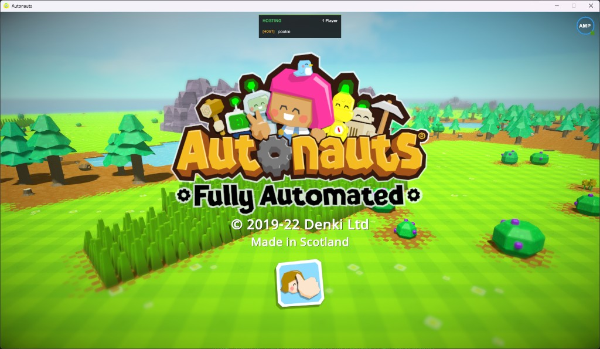
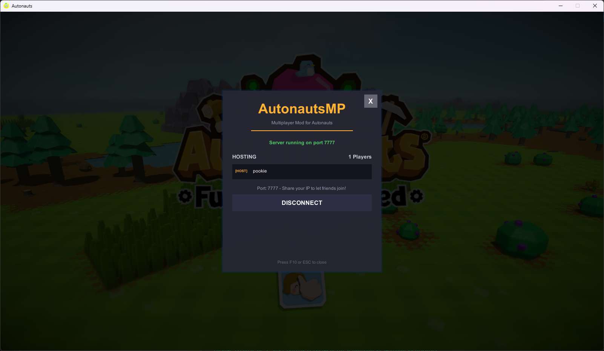

# AutonautsMP

A multiplayer mod for [Autonauts](https://store.steampowered.com/app/979120/Autonauts/) using BepInEx 5.





## Features

- **Host & Join** - Start a server or connect to a friend's game
- **In-game UI** - Easy-to-use multiplayer panel accessible via F10 or the MP button
- **Player List** - See who's connected with host/client indicators
- **Auto-Updater** - Built-in update checker downloads new versions from GitHub
- **One-Click Install** - Automatic BepInEx installation

## Installation

### Easy Install (Recommended)

1. Download the latest release from [Releases](https://github.com/mitchellcirey/AutonautsMP/releases)
2. Extract the ZIP
3. Run `AutonautsMP.exe`
4. The installer will automatically:
   - Find your Autonauts installation
   - Install BepInEx if needed
   - Install the mod

### Checking for Updates

Just run `AutonautsMP.exe` again - it will check GitHub for newer versions and update automatically.

### Manual Installation

1. Install [BepInEx 5.4.22](https://github.com/BepInEx/BepInEx/releases/tag/v5.4.22) into your Autonauts game folder
2. Copy `AutonautsMP.dll` and `Telepathy.dll` to `Autonauts/BepInEx/plugins/AutonautsMP/`
3. Launch the game

## Usage

1. Press **F10** or click the **MP** button (top-right corner) to open the multiplayer panel
2. Enter your display name
3. Click **HOST** to start a server, or enter an IP and click **JOIN** to connect
4. Share your IP address with friends so they can join (default port: 7777)
5. Press **F10** or **ESC** to close the panel

## Building from Source

```powershell
# Build mod only
dotnet build -c Release

# Build everything (mod + installer)
.\package.ps1

# Quick dev install (builds and copies to game folder)
.\install-dev.ps1
```

## Troubleshooting

**ReflectionTypeLoadException errors:**
1. Ensure BepInEx 5.4.22 is installed (NOT version 6)
2. Delete the `BepInEx/cache/` folder and restart the game

**Can't connect to host:**
1. The host may need to port forward port 7777 (TCP/UDP)
2. Ensure firewall isn't blocking the connection
3. Verify you're using the correct IP address

**Installer can't find Autonauts:**
1. Run the installer and manually enter your game path when prompted
2. The game is typically at: `C:\Program Files (x86)\Steam\steamapps\common\Autonauts`

## License

This project is licensed under a custom restrictive license. See [LICENSE](LICENSE) for details.

**TL;DR:** You may use this mod personally, but you may NOT redistribute, sell, or claim this code as your own.
